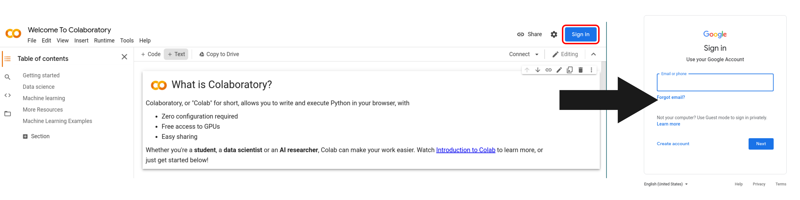
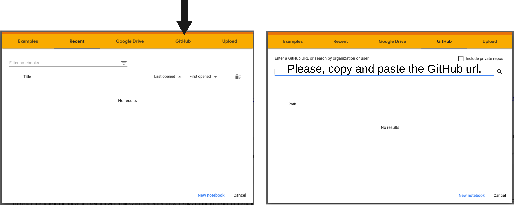
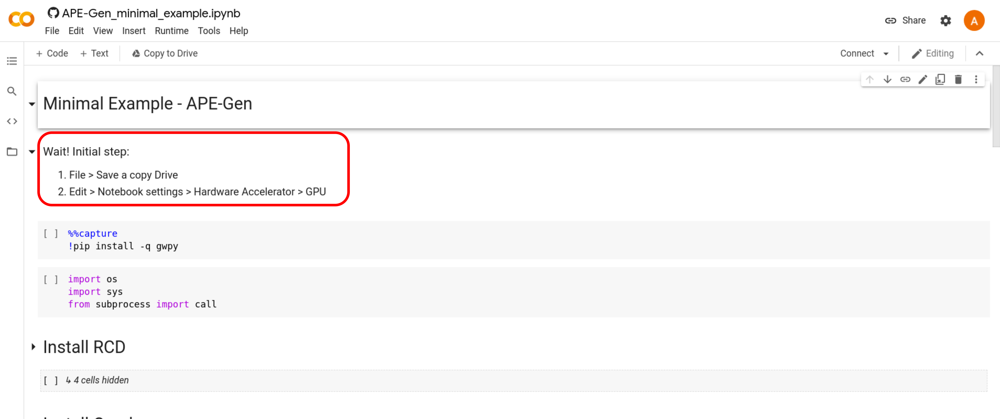

## Google Colab

### Colab is a free notebook environment that runs entirely in the cloud.  

## Why should I use it?

There are plenty of reasons to use Google Colab. In summary, it is a collaborative environment (Colab stands for Collaboratory :eyes:) to code and share workflows among users. It lets you and your team members edit documents the way you work with Google Docs. Additionally, Google Colab provides a good computational environment, allowing statistical analysis or even machine learning processes. In fact, there are a few ways to go up to 25Gb memory and use free GPU processors! :scream:

#### Plus, Colab is free to use!  :heart_eyes:

## Setup enviroment

To assess Google Colab, will necessary a **Gmail** account. Next, we can search for "Colab" on Google or simply copy and paste the link below: https://colab.research.google.com/

1. Login on Google Colab

**Note:** You should have at least 1 GB of free storage on your Google Drive. Nowadays, the standard Google accounts start with 15 GB. 

2. Connecting with ISMCO repository

To connect with the ISMCO repository, you will need to copy and paste the repository address: https://github.com/AntunesLab/ISMCO-2021-TUTORIAL/blob/main/T05_APE-Gen_tutorial.ipynb. Next, hit the **search** button. 

3. Copying APE-Gen_minimal_example to your own Google Drive

Congrats! If you can see the screenshot below, it means that you made it through the whole setup process! We are at the very end! **However, there is a final step required.** :blush:

Hold on! To avoid any potential conflicts among users, each student should have an individual notebook. To do so, we can follow the first lines on the "APE-Gen_minimal_example" file. In short, that will create a private copy in your Google Drive.

> Wait! Initial step:
> 
> 1. File > Save a copy Drive
> 2. Edit > Notebook settings > Hardware Accelerator > GPU 

# That's all folks!

